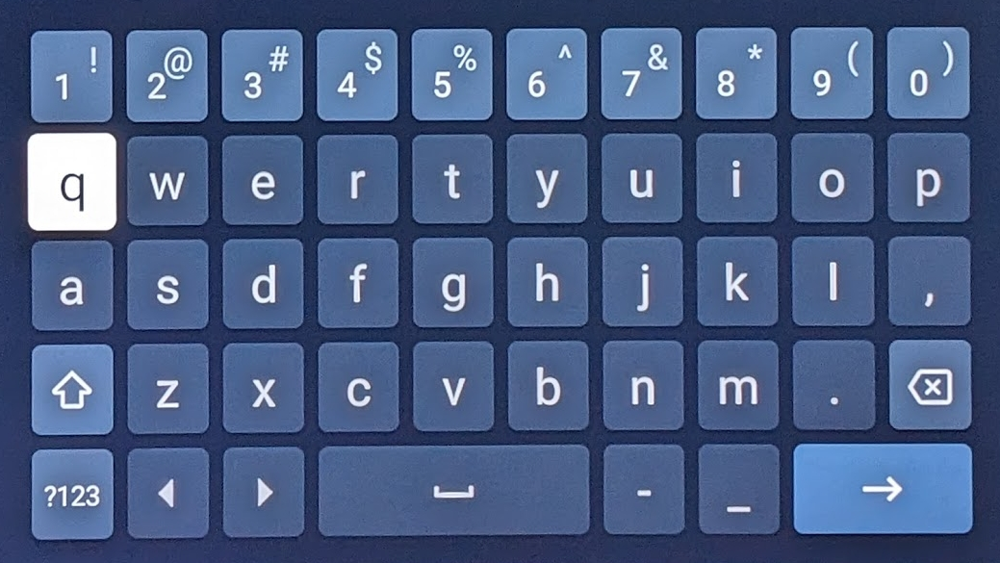

# tv-password-helper
<!-- markdown-link-check-disable-next-line -->
[](https://github.com/maxbechtold/tv-password-helper/actions/workflows/gradle.yml)  
Lowering your effort of entering passwords through TV remotes.

## The problem


Using the remote control arrow keys to select characters on the TV screen is cumbersome despite the "Wheel of Fortune" vibes. Especially if you use special characters in your password, which are often hidden on another screen.  
This is where the *TV Password Helper* jumps in. It finds you a password that has the shortest "path" on the keyboard - your thumb will thank you!

## How it works

This tools accepts password candidates line-by-line, e.g. from a password manager ([KeePass](https://keepass.info) has a preview function which generates ~30 passwords of a given complexity) or from an online tool like https://manytools.org/network/password-generator/ (but it's up to **you** to check the quality and integrity of the passwords generated).

Finish your input with an empty line. Then, the tool will estimate the *effort* to enter each password (approximate distance to cover on the TV on-screen keyboard) and choose the simplest one (but not simpler than a given hardness threshold, defaults to 0.55 of the most complex candidate).

The following illustrates the usage and shows the output (candidate + effort):

```
Enter words line by line. Calculation starts after first empty line
Wt4U^Hm6?y
f7Evz}W+V^
aD}@bQm(H6
^mrWs6z-fM
j%mBQ&Z2.k

Got 5 words with distance up to 122
Proposing aD........ (81)
```

As your password is among the words entered, you should close the console window to clear any traces.

## How to run it

### IntelliJ IDEA (or other Java IDEs)
Set up the project, run `gradlew build` and start `main.kt`.  

### On the command line
Run `gradlew installDist` to get a portable installation in `build/install`.  
You can copy it to any system which has a JRE (11 or later) and run the app with the batch script in `bin/`

## Limitations
This tool is far from perfect, see the Issues for shortcomings or bugs.  
For now, it supports the following keyboard layouts:
- Netflix (English/qwerty)
- Disney+ (English/qwerty)
- Paramount+ (English/qwerty)

Further layouts/languages might be added in the future, and also other popular TV apps. Feel free to open an issue.

## Warning
Passwords are sensitive data, so you should actually not trust this tool - you can however check the source code and see that the following is true
- it will not store or expose your passwords
- it will not use the passwords in any way

Also keep in mind
- it says nothing about the security or quality of your passwords, just estimates their input effort
- it might suggest passwords too simple to be of any use - it's up to you to decide if you want to use the proposed password
